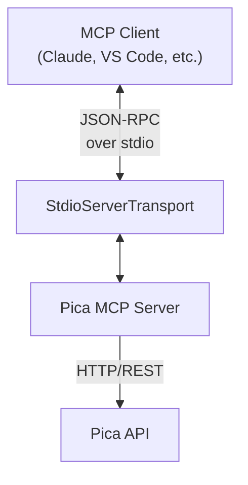

# Pica MCP Server

A Model Context Protocol (MCP) server that integrates with the Pica API platform, enabling seamless interaction with various third-party services through a standardized interface.

## Features

### 🔧 Tools
- **list_user_connections_and_available_connectors** - List all available connectors and active connections
- **get_available_actions** - Get available actions for a specific platform
- **get_action_knowledge** - Get detailed information about a specific action
- **execute_action** - Execute API actions with full parameter support
- **generate_action_config_knowledge** - Generate request configurations for code generation

### 📚 Resources
- **pica-platform://{platform}** - Browse available actions for a platform
- **pica-connection://{platform}/{key}** - View connection details
- **pica-action://{actionId}** - Get detailed action information

### 💬 Prompts
- **create-api-integration** - Generate code for API integrations
- **list-platform-actions** - Get formatted lists of platform actions

### 🤖 Sampling
The server supports the MCP sampling capability for generating contextual responses based on conversation history.

## Architecture



## Installation

```bash
npm install @picahq/pica-mcp
```

## Configuration

Set the following environment variables:

```bash
# Required
export PICA_SECRET="your-pica-secret-key"

# Optional
export PICA_BASE_URL="https://api.picaos.com"  # Default
export DEBUG="true"  # Enable debug logging
```

## Usage

### As a Standalone Server

```bash
# Using npx
npx @picahq/pica-mcp

# Or if installed globally
pica-mcp
```

### With MCP Inspector

```bash
npm run inspector
```

### In Claude Desktop

Add to your Claude configuration file:

```json
{
  "mcpServers": {
    "pica": {
      "command": "npx",
      "args": ["@picahq/pica-mcp"],
      "env": {
        "PICA_SECRET": "your-pica-secret-key"
      }
    }
  }
}
```

## Examples

### List Available Connections

```typescript
// Using the list_user_connections_and_available_connectors tool
const result = await client.callTool({
  name: "list_user_connections_and_available_connectors"
});
```

### Get Platform Actions

```typescript
// Using the get_available_actions tool
const actions = await client.callTool({
  name: "get_available_actions",
  arguments: {
    platform: "slack"
  }
});
```

### Execute an Action

```typescript
// Using the execute_action tool
const result = await client.callTool({
  name: "execute_action",
  arguments: {
    actionId: "action-id",
    connectionKey: "connection-key",
    method: "POST",
    path: "/api/messages",
    data: {
      channel: "#general",
      text: "Hello from MCP!"
    }
  }
});
```

### Generate Integration Code

```typescript
// Using the generate_action_config_knowledge tool
const config = await client.callTool({
  name: "generate_action_config_knowledge",
  arguments: {
    platform: "slack",
    action: {
      _id: "send-message",
      path: "/api/messages"
    },
    method: "POST",
    connectionKey: "slack-connection-key",
    data: {
      channel: "#general",
      text: "Hello!"
    }
  }
});
```

## Development

### Building

```bash
npm run build
```

### Watching for Changes

```bash
npm run watch
```

### Running with Debug Mode

```bash
DEBUG=true npm run build && node build/index.js
```

## API Reference

### Tools

#### list_user_connections_and_available_connectors
Lists all connections in the user's Pica account and available connectors.

**Parameters:** None

**Returns:**
- `connections`: Array of active connections
- `availablePicaConnectors`: Array of available connectors

#### get_available_actions
Get available actions for a specific platform.

**Parameters:**
- `platform` (string, required): Platform name

**Returns:**
- `actions`: Array of available actions with id, title, and tags

#### get_action_knowledge
Get detailed information about a specific action.

**Parameters:**
- `actionId` (string, required): Action ID

**Returns:**
- `action`: Detailed action information including knowledge base

#### execute_action
Execute a specific action through the Pica API.

**Parameters:**
- `actionId` (string, required): Action ID
- `connectionKey` (string, required): Connection key
- `method` (string, required): HTTP method
- `path` (string, required): API path
- `data` (object, optional): Request body
- `pathVariables` (object, optional): Path variables
- `queryParams` (object, optional): Query parameters
- `headers` (object, optional): Additional headers
- `isFormData` (boolean, optional): Send as multipart/form-data
- `isFormUrlEncoded` (boolean, optional): Send as URL-encoded

**Returns:**
- `result`: API response data
- `requestConfig`: Request configuration details

#### generate_action_config_knowledge
Generate request configuration for code generation.

**Parameters:**
- `platform` (string, required): Platform name
- `action` (object, required): Action object with _id and path
- `method` (string, required): HTTP method
- `connectionKey` (string, required): Connection key
- `data` (object, optional): Request body
- `pathVariables` (object, optional): Path variables
- `queryParams` (object, optional): Query parameters
- `headers` (object, optional): Additional headers
- `isFormData` (boolean, optional): Send as multipart/form-data
- `isFormUrlEncoded` (boolean, optional): Send as URL-encoded

**Returns:**
- `requestConfig`: Complete request configuration
- `typeScriptCode`: Example TypeScript code

### Resources

Resources can be read using the MCP resource protocol:

- `pica-platform://{platform}` - List of actions for a platform
- `pica-connection://{platform}/{key}` - Connection details
- `pica-action://{actionId}` - Detailed action information

### Prompts

#### create-api-integration
Generate code for API integrations.

**Arguments:**
- `platform` (string, required): Target platform
- `action` (string, required): Action to perform
- `language` (string, optional): Programming language (default: "typescript")

#### list-platform-actions
Get a formatted list of available actions.

**Arguments:**
- `platform` (string, required): Target platform

## Error Handling

The server implements comprehensive error handling:

- Connection validation before action execution
- Path variable validation and substitution
- Graceful handling of API failures
- Detailed error messages for debugging

## Security

- API keys are passed via environment variables
- Connections are validated before use
- All requests include proper authentication headers

## License

GPL-3.0

## Support

For support, please contact support@picaos.com or visit https://picaos.com
